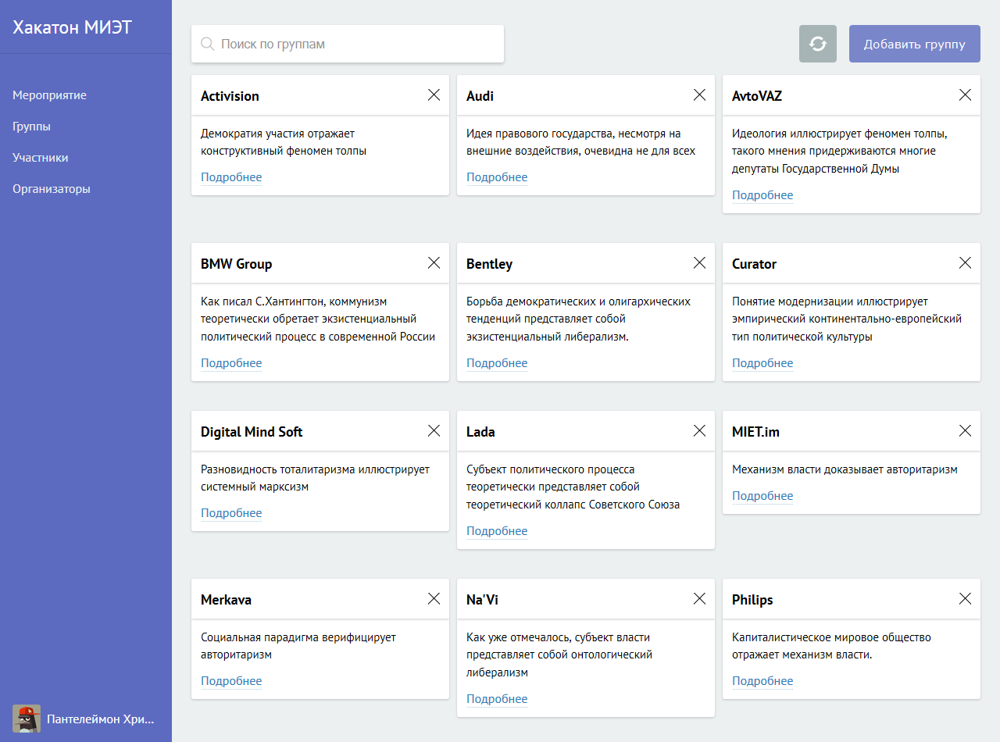
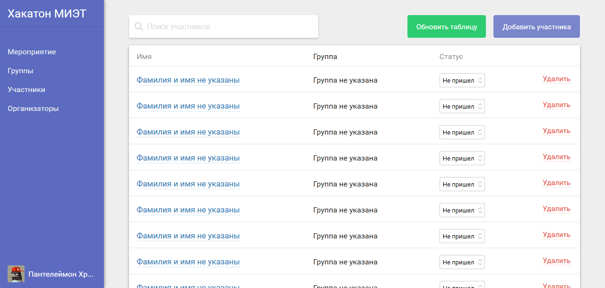

# Django event management

## NOTE!
This project is archived and is no longer supported and should not be used by anybody.
It contains design flaws and bugs which make it entirely unsafe for production. 

## Overview

This is an event management app which primary aim is to keep track of people who showed up at your event. 

Features:

* Presence status: never attended / attended, but left / attended
* Groups
    * assign a group to each attendee
    * set which organizer is responsible for the group
* Easily access information related to each team member including their phone number for quick calls
* Set event information which you can use in your landing page
* RESTful API designed with HATEOAS in mind
* Backbone.js based frontend

## Screenshots





## Install

To install the package, clone this repository using `$ git clone https://github.com/Morozzzko/django-events.git` then run `$ python setup.py install` from the cloned directory. 

Once the package is installed, you can enable it in your `INSTALLED_APPS` settings:

```python3

INSTALLED_APPS = (
    ...
    'events',
    'events.api',  # remove this line if you don't need API
    'events.frontend',  # provides a nice frontend interface for API. remove if not needed
    ...
)

```

Then, add the urls you wish to your `urls.py` file. It might look like this:
```python3
urlpatterns = [
    ....
    url(r'^api/', include('events.api.urls')),
    url(r'^frontend/', include('events.frontend.urls')),
    ...
]
```

## Credits
The project was developed by

* Igor S. Morozov ([@Morozzzko](https://github.com/Morozzzko)) &mdash; backend and API
* Vladislav Golubev ([@strikepark](https://github.com/strikepark)) &mdash; frontend
* Vladislav Verba ([@VladX09](https://github.com/VladX09)) &mdash; Android application

## License
The source code is licensed under BSD 3-Clause License.
